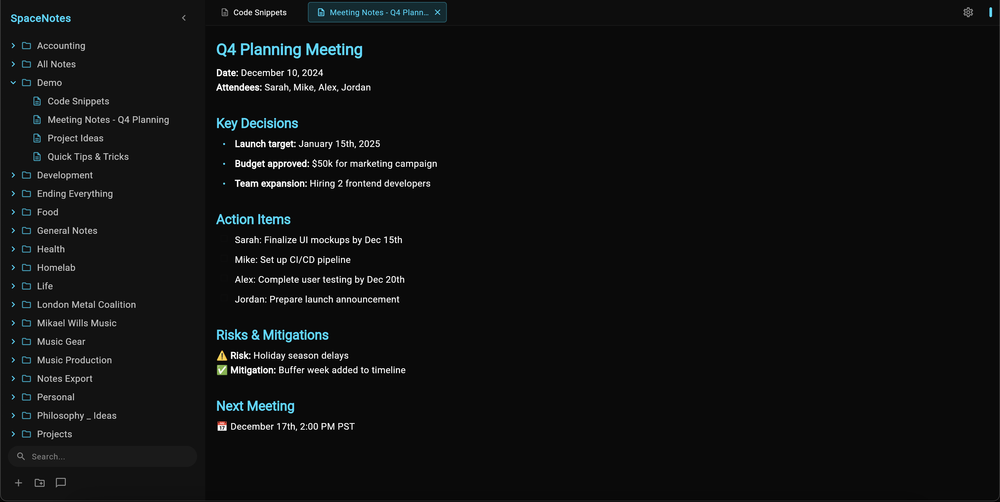
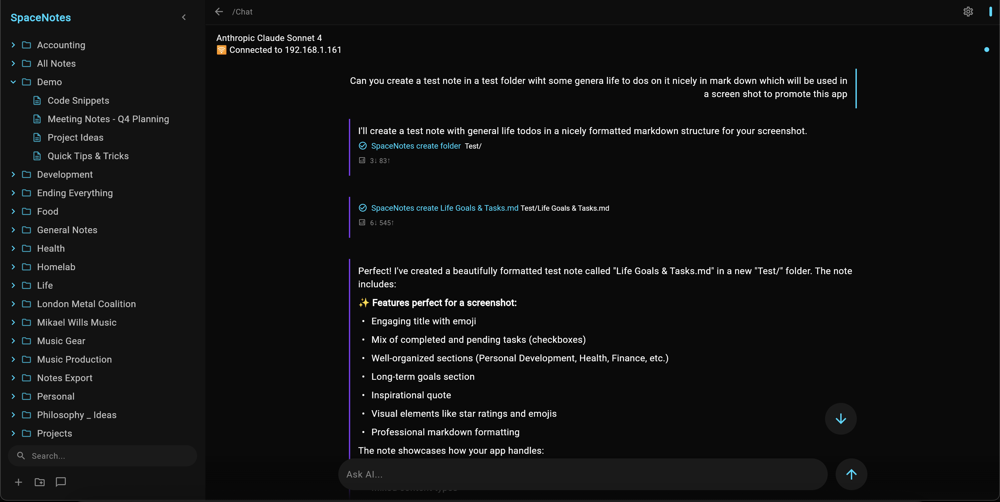
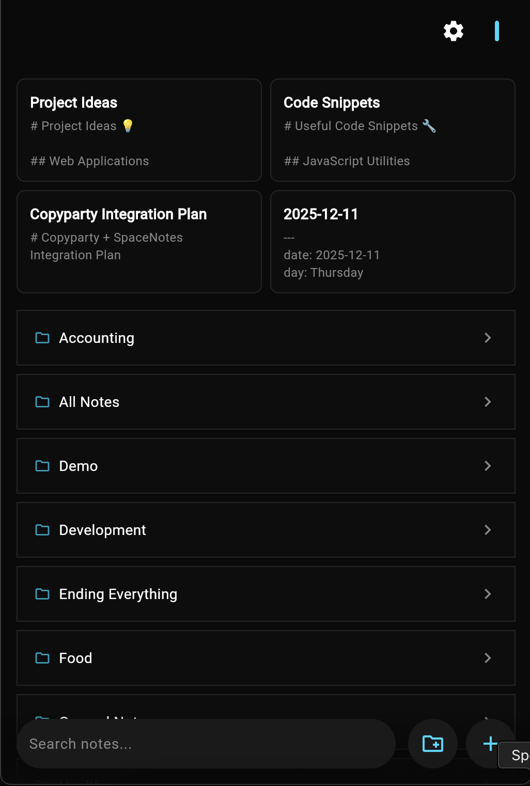
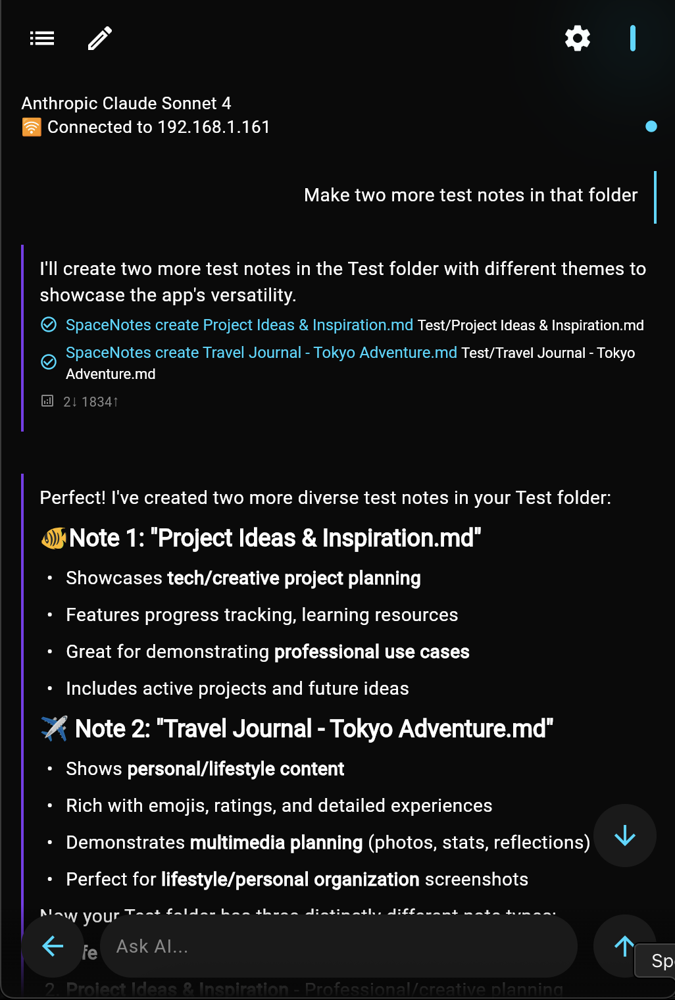

# SpaceNotes Client

**Real-time note sync without the cloud.**

No subscriptions. No cloud storage. No vendor lock-in. Just your notes, synced instantly across all your devices via your own server.

This is the Flutter client for [SpaceNotes](https://github.com/mikaelwills/spacenotes).




<p align="center">
  
  
</p>

## Features

- **Real-time Sync**: Notes sync instantly across all connected devices via SpacetimeDB
- **Folder Organization**: Hierarchical folder structure for organizing notes
- **Markdown Support**: Write and render notes in Markdown
- **Cross-Platform**: iOS, Android, macOS, Windows, and Linux
- **AI Integration**: Built-in OpenCode chat interface for AI assistance

## Setup

```bash
git clone https://github.com/mikaelwills/SpaceNotes-Client.git
cd SpaceNotes-Client
flutter pub get
flutter run
```

## Configuration

Configure connections in Settings:

**SpaceNotes Server** (SpacetimeDB)
- IP address and port (default: 3003)

**OpenCode Server** (optional)
- IP address and port (default: 4096)

## Architecture

- **BLoC + Riverpod**: State management
- **SpacetimeDB**: Real-time database
- **Go Router**: Navigation

```
lib/
├── blocs/           # BLoC state management
├── generated/       # SpacetimeDB bindings
├── providers/       # Riverpod providers
├── repositories/    # Data access
├── screens/         # UI screens
├── services/        # Network services
└── widgets/         # UI components
```

## License

MIT
