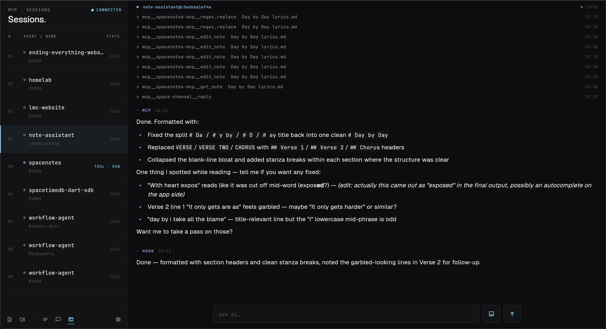
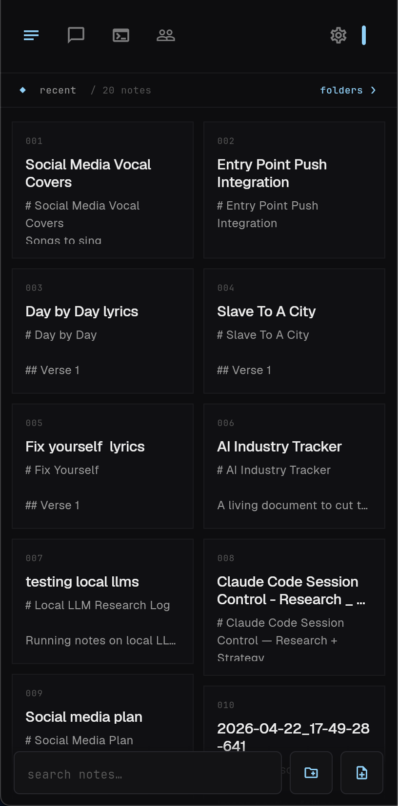
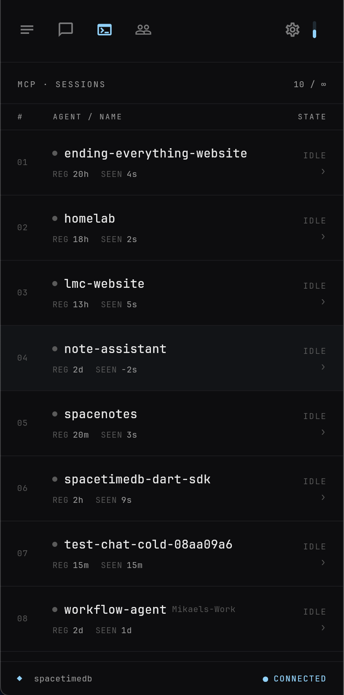

# SpaceNotes Client

Flutter client for [SpaceNotes](https://github.com/mikaelwills/spacenotes) — a self-hosted notes system with real-time sync and a built-in bridge to Claude Code agents.

This is just the client app — iOS, Android, macOS, Windows, Linux, and web. It subscribes to your SpaceNotes server's SpacetimeDB and renders notes plus a live dashboard of any Claude Code sessions running through SpaceChannel.

For the server, sync daemon, MCP, Docker stack, architecture, and setup, see the **[main SpaceNotes repo](https://github.com/mikaelwills/spacenotes)**.




<p align="center">
  
  
  
</p>

## Building

```bash
flutter pub get
flutter run
```

## License

GPL-3.0 — See the [main SpaceNotes repository](https://github.com/mikaelwills/spacenotes) for full license details.
